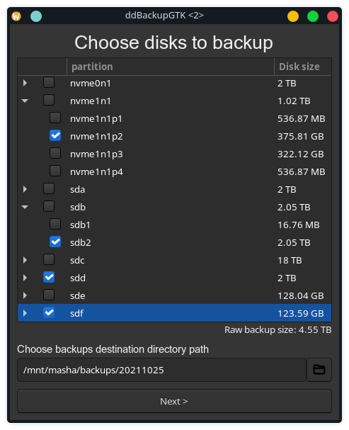
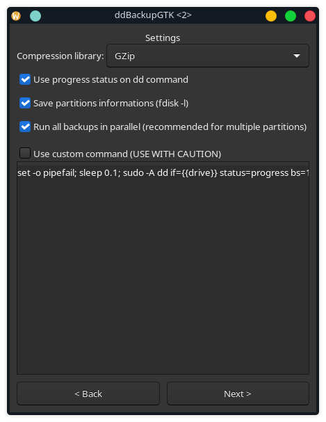
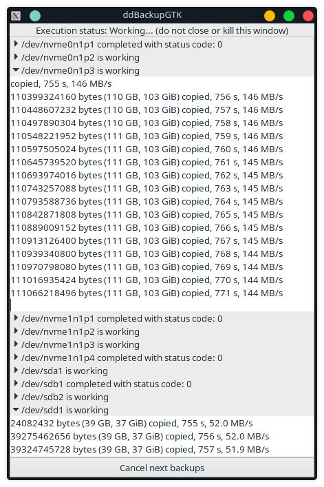

# ddNetBackup

## Introduction

This project contains set of libraries for making disks and partitions backup using POSIX commands, including `dd` and `fdisk`. Windows is not supported. All libraries are coded using .Net 5+.

In theory, all systems with support of basic bash/POSIX commands should work.

## C# Projects

Working projects:
- ddNetBackupLib - base library containing logic for making backups
- ddNetBackupGuiGtk - fully functional and tested graphical interface based on GtkSharp

Projects on hold (not finished):
- ddNetBackupCli - making backups from command line
- ddNetBackupAvalon - alternative to ddNetBackupGuiGtk, but written with Avalon, instead of Gtk

## Functions
- selective partitions chooser
- parallel backup execution (per partition)
- automatic backup compression on fly (gzip/bzip2)
- transparency and customizable/editable command

## To do list
- refactor code and fix issues reported by SonarQube
- save last chosen settings in Gtk application
- finish CLI/Avalonia projects
- provide time finish estimate by backup library

## Tests
Currently, library was only tested on Manjaro using ddNetBackupGuiGtk on KDE Plasma 5.23.1.

## Screenshots from GTK application

